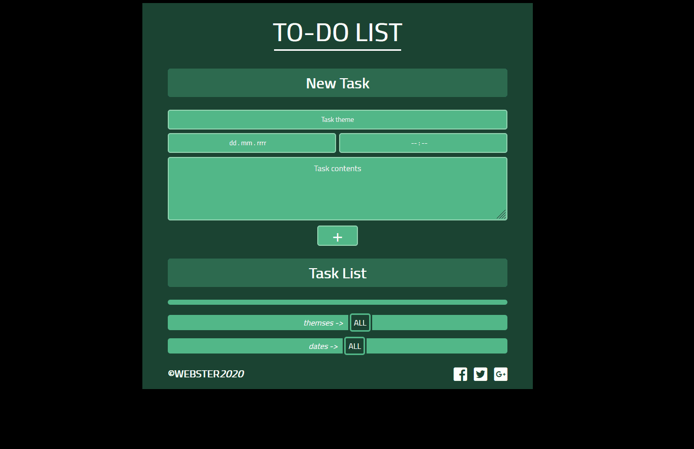

# MEMORY

ORAGANIZER (TO-DO-LIST) is aplication to creating and saving tasks. It allows to add theme of task, date, time and some description and save it. Thanks to tags, tasks are sorted by date or by theme - it allows to display tasks e.g. from current day. Created tasks can be removed or checked as done (without removing). I created it to train my skills in basic html, scss and Vanilla JS and to create something usefull. This project was prepared with handlebars.js library to create HTML templates. For styling I used pure scss styling. Structure of the project is very simple: index.html file with HTML code, style.scss file with styles and script.js file with all JS code.

## How it works

## Link
https://webster2020.github.io/TO-DO-LIST/

## Getting Started
1. git clone git@github.com:Webster2020/TO-DO-LIST.git
2. npm install
3. npm run watch - run the project and than You can see it on Your device

*...or use link if You only want to check how it works

Used technologies:
 1. Vanilla JS with ES6+ standard with Handlebars.js library
 2. SCSS for styling
 3. HTML5 for content

Implemented solutions

 1. Content are divided into several parts:
  - header with title
  - form with forms to create task
  - part 'tasks' where content is creating with Handlebars.js templates 
  - part 'tags' where tags are creating with Handlebars.js templates
  - footer
 2. Styles are divided into several parts:
  - constants
  - global
  - header
  - form
  - tasks
  - tags
  - footer
 3. JS code is divided into several parts:
  - 'select' object with HTML selectors
  - 'className' object with CSS classes names
  - global variables and functions
  - app object
  - 'Input' class
  - 'Task' class
  - 'Tag' class
 4. ORAGANIZER functionalities:
  - NEW TASK:
  - creating new task with inputed theme of task, data, time and description
  - checking inputed date and theme and if they are new ones, creating new tags
  - checking and highlighting empty input with button '+' clicking before creating new task
  - clearing all inputs after adding new task
  - TASKS:
  - displaing tasks using Handlebars.js
  - showing and hidding description of task
  - checking/unchecking task as 'done' 
  - removing task
  - TAGS:
  - displaing tags using Handlebars.js
  - showing and hidding tasks match to clicked tag
  - showing all tasks by clicked 'all' tag 

### Project architecture

Project is not diveded on component (like in e.g. React), because of its structure size is simple:
 1. HTML - content of aplication
 2. SCSS - all styles
 3. JS - all functions and logic for aplication divided into objects and classes
 4. root file: index.html
 5. configuration files: gitignore, package.json etc.

### How did I create this project?

Project was prepared based on my own idea.

## Plan for future dvelopment

 - Fix minor bugs in tags
 - Refactoring code - divide script.js into parts (every class in separate file)

## Authors

* **Michal Szwajgier** - *Webster2020* - 

## License
Free licence
